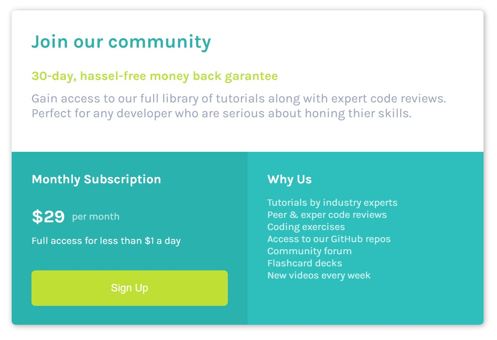

# Frontend Mentor - Single price grid component solution

This is a solution to the [Single price grid component challenge on Frontend Mentor](https://www.frontendmentor.io/challenges/single-price-grid-component-5ce41129d0ff452fec5abbbc). Frontend Mentor challenges help you improve your coding skills by building realistic projects. 

## Table of contents

- [Overview](#overview)
  - [The challenge](#the-challenge)
  - [Screenshot](#screenshot)
  - [Links](#links)
- [My process](#my-process)
  - [Built with](#built-with)
  - [What I learned](#what-i-learned)
  - [Continued development](#continued-development)
- [Author](#author)
- [Acknowledgments](#acknowledgments)

## Overview

### The challenge

Users should be able to:

- View the optimal layout for the component depending on their device's screen size
- See a hover state on desktop for the Sign Up call-to-action

### Screenshot

### Links

- Solution URL: [Solution URL](https://taylor1038.github.io/pricing-card-frontend/)

## My process

I initialized and configured a GitHub repository to maintain version control for this project. The project utilizes GitHub pages to easily publish this project for other to view. I initially created the HTML backbone then styles the borders and flex boxes to get an idea of how to make the divs flow into place. After that I added all the CSS classes and queries to make it stylish and flow from mobile to desktop and back.

### Built with

- Semantic HTML5 markup
- CSS custom properties
- JavaScript
- Flexbox
- CSS Grid
- Mobile-first workflow
- [Styled Components](https://styled-components.com/) - For styles

### What I learned

I learned a lot about mobile first web development, CSS styling, flex boxes, and HTML.

This helped cement the many CSS properties and how they affect HTML tags.

Learning more about flex boxes has also greatly improved my front-end workflow. 

### Continued development

I will continue to work on my implementation of flex boxes and JS in my frontend development.

## Author

- Website - [Portfolio Site](https://www.stephen.photography/portfolio)

## Acknowledgments

Zach Gollwitzer's front end tutorial series and frontendmentor.io were both extremely helpful for this project
